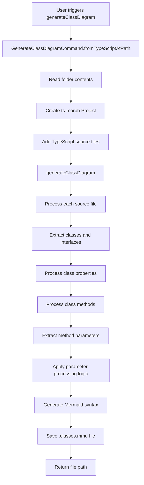
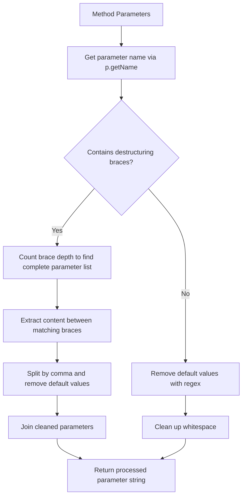

# VSCode Mermaid Extension Architecture

This document describes the architecture and data flow of the VSCode Mermaid Extension, with focus on the class diagram generation functionality.

## Overview

The VSCode Mermaid Extension provides functionality to generate and view Mermaid diagrams directly within Visual Studio Code. The extension supports multiple diagram types and includes specialized functionality for generating class diagrams from TypeScript source code.

## Core Components

### Extension Entry Point
- **File**: `src/extension.ts`
- **Purpose**: Registers commands and activates the extension
- **Key Commands**:
  - `vscode-mermaid-extension.generateClassDiagram`
  - `vscode-mermaid-extension.viewDiagram`

### Class Diagram Generation
- **File**: `src/commands/GenerateClassDiagramCommand.ts`
- **Purpose**: Analyzes TypeScript source code and generates Mermaid class diagrams
- **Key Dependencies**: 
  - `ts-morph` for TypeScript AST parsing
  - Custom import processing logic

### Diagram Viewing
- **File**: `src/commands/ViewDiagramCommand.ts`
- **Purpose**: Renders Mermaid diagrams in VSCode webview
- **Components**:
  - Webview panel management
  - Mermaid.js integration
  - Live diagram updating

## Class Diagram Generation Flow



## Parameter Processing Logic (Bug Fix)

The parameter processing in step L above includes the critical bug fix for default parameters:



### Parameter Processing Rules

1. **Nested Brace Handling**: Use brace counting to properly extract complete destructured parameter lists
2. **Default Value Removal**: Strip assignments like `= {}`, `= false`, `= "default"` from each parameter
3. **Parameter Name Extraction**: Extract only parameter names, removing complex default value expressions
4. **Whitespace Normalization**: Clean up extra spaces and formatting

### Key Implementation Details

The bug fix specifically addresses the challenge of destructured parameters with complex default values:
- **Problem**: `{ content = {}, useTextExtract = false }` was incorrectly parsed due to nested braces
- **Solution**: Proper brace counting ensures complete parameter extraction
- **Result**: All parameters are correctly identified and default values are stripped

## Data Flow

### Input Processing
1. **Source Discovery**: Scan folder for TypeScript files
2. **AST Parsing**: Use ts-morph to parse TypeScript syntax trees
3. **Symbol Extraction**: Identify classes, interfaces, methods, properties

### Diagram Generation
1. **Structure Analysis**: Process class hierarchies and relationships
2. **Parameter Processing**: Apply bug fix logic to method signatures
3. **Mermaid Syntax**: Generate valid Mermaid class diagram syntax
4. **File Output**: Save generated diagram to `.classes.mmd`

### Error Handling
- **Invalid TypeScript**: Skip files with parse errors
- **Empty folders**: Return false for empty directories
- **File system errors**: Show user-friendly error messages

## Key Interfaces

### SourceRoot
```typescript
interface SourceRoot {
  glob: string[];      // File patterns to include
  output: string;      // Output file path
}
```

### Parameter Processing
The core bug fix centers around this transformation:
```typescript
// Before: Raw parameter text with defaults
"content = {}, useTextExtract = false"

// After: Cleaned parameter list
"content, useTextExtract"
```

## Testing Strategy

### Unit Tests
- **Parameter processing**: Verify default value removal
- **Destructuring**: Confirm parameter flattening
- **Complex cases**: Test real-world problematic code
- **Edge cases**: Handle unusual TypeScript syntax

### Integration Tests
- **End-to-end**: Full workflow from TypeScript to Mermaid
- **File system**: Test with actual project structures
- **Error scenarios**: Verify graceful error handling

## Dependencies

### Core Dependencies
- **ts-morph**: TypeScript AST manipulation
- **vscode**: VS Code extension API
- **path**: File system path handling

### Development Dependencies
- **TypeScript**: Language compilation
- **ESLint**: Code quality
- **Jest**: Unit testing framework

## Performance Considerations

### Optimization Strategies
1. **Incremental parsing**: Only process changed files
2. **Caching**: Store parsed AST results
3. **Lazy loading**: Load ts-morph only when needed
4. **Progress reporting**: Show user feedback for large projects

### Memory Management
- **Project disposal**: Clean up ts-morph resources
- **File streaming**: Process large codebases incrementally
- **Garbage collection**: Release AST references after processing 
